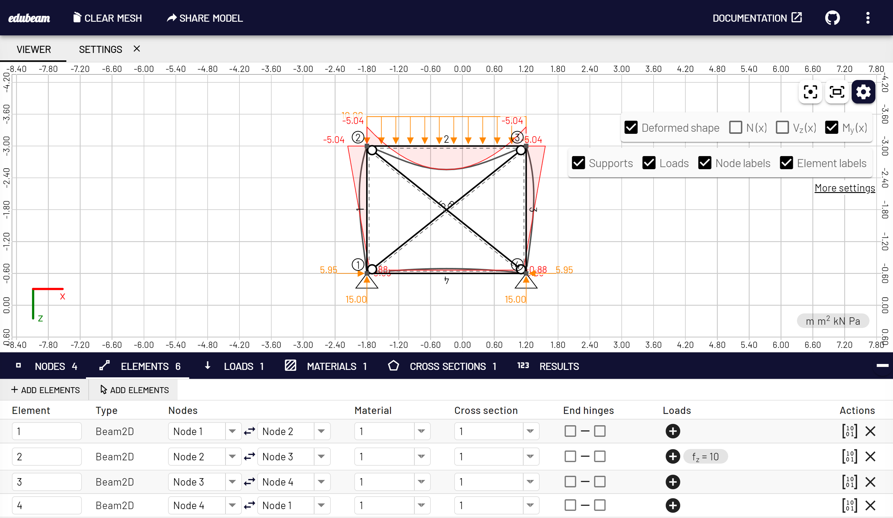

<br/>
<p align="center">
  <a href="https://github.com/janvorisek/edubeam">
    
  </a>

  <h3 align="center">edubeam</h3>

  <p align="center">
    Building Knowledge, One Beam at a Time
    <br/>
    <br/>
    <a href="https://edubeam.app"><strong>Explore the docs »</strong></a>
    <br/>
    <br/>
    <a href="https://run.edubeam.app">Run edubeam</a>
    ·
    <a href="https://github.com/janvorisek/edubeam/issues/new?assignees=&labels=&projects=&template=bug_report.md&title=%5BBUG%5D">Report Bug</a>
    ·
    <a href="https://github.com/janvorisek/edubeam/issues/new?assignees=&labels=&projects=&template=feature_request.md&title=%5BFEATURE%5D">Request Feature</a>
  </p>
</p>

<p align="center">

  

</p>

## Table Of Contents

- [About the Project](#about-the-project)
- [Start developing](#usage)
- [Roadmap](#roadmap)
- [Contributing](#contributing)
- [License](#license)

## About The Project

[](https://run.edubeam.app)

Welcome to EduBeam, an innovative educational project dedicated to simplifying structural analysis for 2D structures. Developed with students and educators in mind, EduBeam provides a user-friendly web-based platform for hands-on learning in structural mechanics. Dive into the world of engineering with ease as you navigate and analyze 2D structures directly in your web browser. This project is an open invitation for collaboration, allowing students to modify and extend the code, reinforcing their understanding of structural analysis and coding principles. Join us in building a community where knowledge and creativity intersect, shaping the future of structural education.

## Start developing

1. Clone the repo

```sh
git clone https://github.com/janvorisek/edubeam.git
```

2. Install NPM packages

```sh
npm install
```

3. Run the development version

```sh
npm run dev
```

We use Vue.js and Vite for blazing fast development.

### Building the production version

The production version is made by running:

```sh
npm run build
```

This produces the `build` directory which can be deployed to any static hosting.

The latest version is automatically deployed on [https://run.edubeam.app](https://run.edubeam.app) from the `main` branch.

## Roadmap

See the [open issues](https://github.com/janvorisek/edubeam/issues) for a list of proposed features (and known issues).

## Contributing

Contributions are what make the open source community such an amazing place to be learn, inspire, and create. Any contributions you make are **greatly appreciated**.

- If you have suggestions for new features or want to report a bug, feel free to [open an issue](https://github.com/janvorisek/edubeam/issues/new/choose) to discuss it. We also welcome pull requests.
- Please make sure you check your spelling and grammar.
- Create individual PR for each suggestion.

### Creating A Pull Request

1. Fork the Project
2. Create your Feature Branch (`git checkout -b feature/AmazingFeature`)
3. Commit your Changes (`git commit -m 'Add some AmazingFeature'`)
4. Push to the Branch (`git push origin feature/AmazingFeature`)
5. Open a Pull Request

## License

Distributed under the GPL-3.0 License. See [LICENSE](https://github.com/janvorisek/edubeam/blob/main/LICENSE) for more information.
