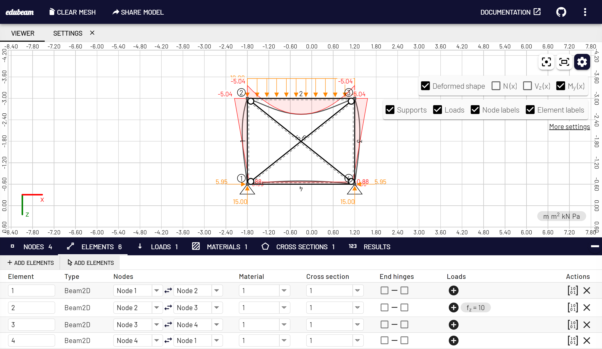
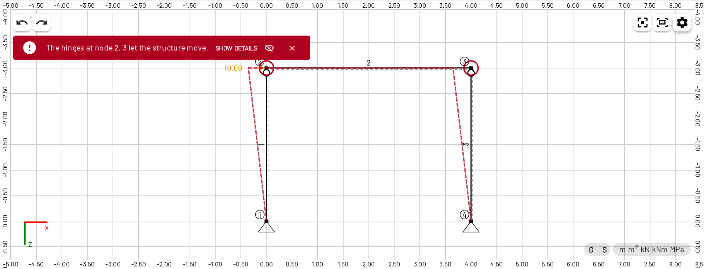
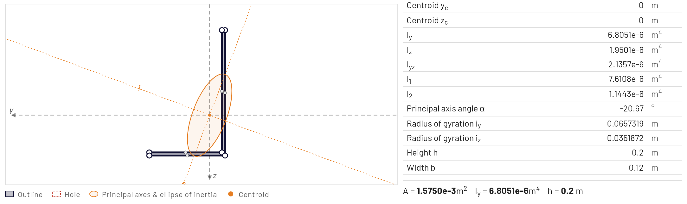
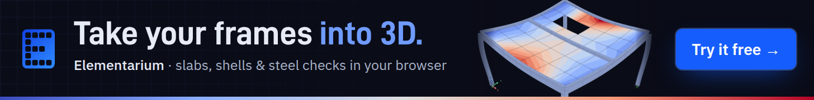

<p align="center">
  <a href="https://run.edubeam.app">
    
  </a>
</p>

<h1 align="center">edubeam</h1>

<p align="center">
  <strong>Sketch a beam, truss or frame in your browser and watch it bend.</strong><br/>
  Free, open source and nothing to install. Made by civil engineers who teach.
</p>

<p align="center">
  <a href="https://run.edubeam.app"><strong>Try it now</strong></a> ·
  <a href="https://run.edubeam.app/?panel=examples"><strong>Browse examples</strong></a> ·
  <a href="https://edubeam.app"><strong>Read the docs</strong></a>
</p>

<p align="center">
  
  
  
  
</p>

<p align="center">
  <a href="https://run.edubeam.app"></a>
</p>

## Hi there 👋

edubeam is a small structural analysis app for 2D beams, trusses and frames. Add a few nodes, connect them, put in supports and a load, and the deformed shape, reactions and N, V and M diagrams are already on screen. Change anything and the results update right away.

It's built for learning. Students can try "what if?" as fast as they can click, and teachers can put a live model in front of a class without installing anything. Everything runs in your browser, and your models stay on your machine.

## What you can do with it

- 🏗️ **Model beams and trusses together.** It uses Timoshenko beams (shear deformation included) and axial-only truss members. You can add end hinges, angled supports and prescribed displacements.
- ⬇️ **Load it however you like.** Point loads, uniform and trapezoidal distributed loads, moments along an element, support settlement, and uniform or gradient temperature loads.
- 📈 **See what's going on.** You get the deformed shape, N, V and M diagrams, reactions and hover tooltips, plus result tables you can copy or save as CSV.
- 🔍 **Find out why a model won't solve.** Instead of a "singular matrix" message, edubeam circles the hinges or supports that let the structure move and animates the motion.
- 🎓 **Look under the hood.** Open any element's stiffness matrix, check the degrees of freedom, and compare the numbers with the [hand calculations in the docs](https://edubeam.app/guide/verification).
- ✏️ **Draw your own cross section.** Pick a preset or draw any polygon, holes included. edubeam calculates the area, moments of inertia, principal axes and the ellipse of inertia for you.
- 🖼️ **Take it with you.** Export SVG for Word, LaTeX or Inkscape, PNG at any size, CSV for spreadsheets, or a readable `project.json`.
- 🌍 **Use it your way.** Mouse, keyboard or touch. Choose your units and number format, z-down or y-up axes, and one of 12 languages.

<table>
  <tr>
    <td width="50%"></td>
    <td width="50%"></td>
  </tr>
  <tr>
    <td align="center"><sub>Too many hinges? edubeam shows you which ones.</sub></td>
    <td align="center"><sub>Draw a section and get its properties.</sub></td>
  </tr>
</table>

New to edubeam? The welcome screen offers **Draw your first beam**, a short guided task that walks you through drawing a beam, supporting it and loading it.

## For teachers

edubeam fits easily into a lecture, a tutorial or homework.

- **Share a model as a link.** _Share model_ puts the whole model into the URL. There are no accounts and no uploads, and every student who opens the link gets their own copy to play with.
- **Embed it in your notes.** Add `viewer=1` to a link and you get a clean, zoomable, read-only model for an `<iframe>`:
  ```html
  <iframe src="https://run.edubeam.app/?viewer=1&model=…" width="100%" height="400"></iframe>
  ```
- **Choose the language for your class.** Add `lang=cs`, `de`, `fr`, `es`, `pt`, `pl`, `cn`, `th`, `tr`, `uk` or `ru` to the link.
- **Collect assignments as files.** <kbd>Ctrl</kbd>+<kbd>S</kbd> saves a plain-JSON `project.json`, so you can generate or check models with a script. See the [file format](https://edubeam.app/essentials/import-export).
- **Start from an example.** The [gallery](https://run.edubeam.app/?panel=examples) has continuous and indeterminate beams, a cantilever, a Pratt truss, a portal frame and a temperature load, all ready to open.

You don't need to worry about losing work: edubeam saves to your browser as you go, and _Recent structures_ brings back the last ten models you cleared.

### Need 3D?

edubeam is happy staying in 2D. When you need 3D frames, slabs and shells, try our sibling app [Elementarium](https://elementarium.app/?utm_source=edubeam&utm_medium=link&utm_campaign=readme).

<a href="https://elementarium.app/?utm_source=edubeam&utm_medium=banner&utm_campaign=leaderboard&utm_content=readme">
  
</a>

## Hacking on edubeam

Want to run it yourself? You need Node.js 20 or newer. CI uses 22.

```bash
git clone https://github.com/janvorisek/edubeam.git
cd edubeam
npm install
npm run dev          # http://localhost:5173
```

That's all you need. Here are the other scripts:

| Command                                | What it does                                      |
| -------------------------------------- | ------------------------------------------------- |
| `npm run dev`                          | Start the dev server with hot reload              |
| `npm run build`                        | Build the app into `dist/`                        |
| `npm test` / `npm run test:run`        | Run the tests in watch mode / once                |
| `npm run lint` / `npm run lint:fix`    | Check `src/` with ESLint / fix what it can        |
| `npm run docs:dev`                     | Preview the documentation site                    |
| `npm run docs:build`                   | Build the documentation site                      |
| `npm run contributors`                 | See who has contributed since the last release    |

### Where things live

```
src/
  views/Editor.vue      the editor: canvas, tables and panels
  components/           SVG viewer, context menus, dialogs, settings
  store/                Pinia stores (project, viewer, layout, clipboard, recent structures)
  CommandManager.ts     undo/redo; every model edit goes through here
  locales/              UI translations, one JSON file per language
  tests/                Vitest specs
docs/                   VitePress documentation, one folder per language
public/changelog/       in-app release notes and their screenshots
```

The finite element solver has its own package: [ts-fem](https://github.com/janvorisek/ts-fem).

### Building and hosting

`dist/` is a plain static site, so you can host it anywhere. These optional environment variables can go in `.env`:

| Variable                  | What it's for                                                             |
| ------------------------- | ------------------------------------------------------------------------- |
| `VITE_BASE`               | Serve the app from a subpath, e.g. `/edubeam/`. Keep the trailing slash.  |
| `VITE_GANALYTICS_TAG_ID`  | Google Analytics tag. Leave it out and analytics stays off.               |
| `SENTRY_AUTH_TOKEN`       | Upload source maps to Sentry during the build.                            |

If you host edubeam in a subfolder, set `VITE_BASE`. Otherwise the assets, the PWA manifest and the service worker all look for files at the root of your domain. The page may still load, but installed copies open the wrong page and update prompts stop working.

Our own copy deploys automatically: `main` goes to [run.edubeam.app](https://run.edubeam.app), and `dev` goes to a preview on Cloudflare Pages.

## Come help out 🤝

You don't have to write code to help. Bug reports, example models, docs fixes and translations are all very welcome, and so are messages telling us how you use edubeam in your classes.

- **Found something odd?** [Open an issue](https://github.com/janvorisek/edubeam/issues). A screenshot or a share link helps a lot.
- **Want to send code?** Branch from `dev`, run `npm run test:run` and `npm run lint`, then open a pull request against `dev`. Small, focused PRs are the easiest to review, and before/after screenshots help if you've changed the UI.
- **Speak another language?** The app strings are in [`src/locales/`](src/locales). [`en.json`](src/locales/en.json) is the source, and the docs are in [`docs/<lang>/`](docs). You can fix a translation or start a new language.

edubeam currently speaks English, Czech, German, Spanish, French, Polish, Portuguese, Russian, Ukrainian, Chinese, Thai and Turkish, and the docs are in Hindi too. Thanks to everyone who helped get it there! ❤️

## License

edubeam is free software under the [GPL-3.0](LICENSE) license.
